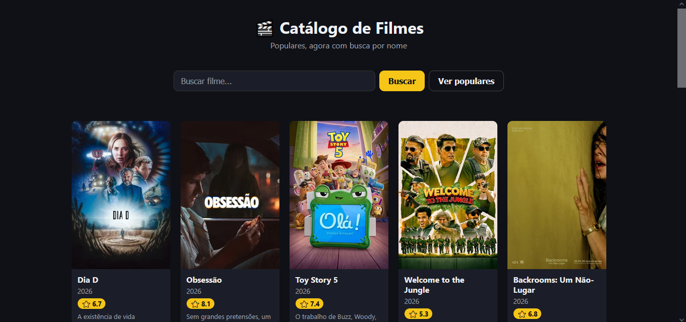
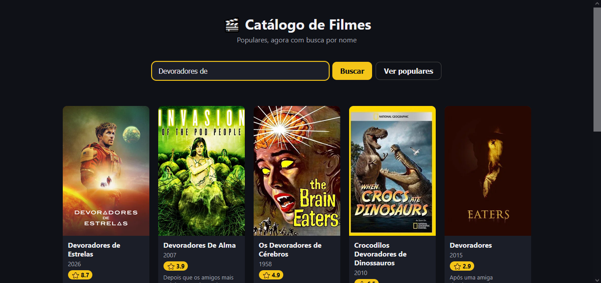

# Catálogo de Filmes com TMDB

**Nome:** Miguel de Freitas Abood

## Endpoint utilizado

`GET /movie/popular` — lista de filmes populares.
A busca por nome usa `GET /search/movie?query=...`.

## Prints

1. Lista de filmes carregada ao abrir a página:
   

2. Resultado após usar a busca:
   

## Fluxo

A função `fetchMovies` faz a requisição assíncrona à API do TMDB com `fetch` e
converte a resposta com `.json()`, retornando o array `results`. Em seguida,
`createMovieCard` transforma cada filme em um elemento de card (poster,
título, ano, nota e sinopse) usando `createElement`/`appendChild`, e
`renderMovies` limpa o container `#movie-list` e insere os cards no DOM,
exibindo uma mensagem via `showMessage` quando a lista está vazia, carregando
ou em erro.
